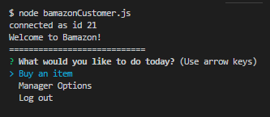
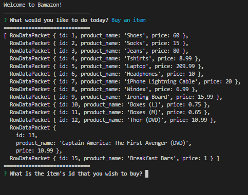
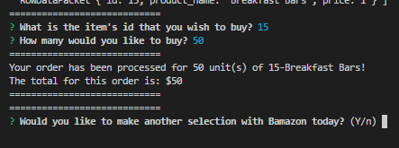
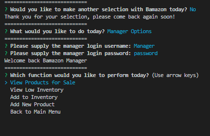
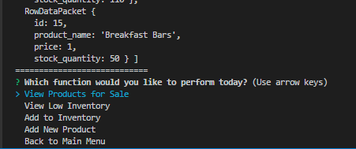
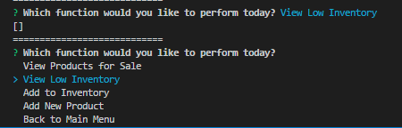
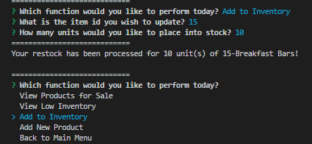
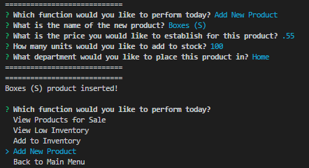
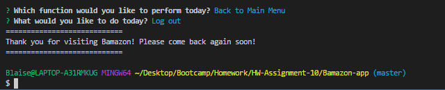

# Bamazon-app

The Bamazon App is a great way to show off the use of node.js in coordination with MySQL in your command line. In this app you will find a way that allows the user to be either the seller or the buyer in the bamazonCustomer.js file

To run this app you will need to download the inquirer and mysql NPM packages.

Below is the instructions to run the Bamazon app. (please refer to the images in the images folder when referenced)

1. upon running bamazonCustomer.js you will be greated by the command line. see image Bamazon-start.jpg

2. using the up and down arrow keys to select 'Buy an item' it will show you all the products available for sale as objects listing out their id number, the product name, and the price in US Dollars ($). see image Bamazon-buyer-item list.jpg

3. to make your selection you must use the items id number, if you try to type any word or number over 100 you will be prompted to submit the item id number again. This is the same for the quantity of the item allowing any number from 1-100 to be selected.

4. after you make your selection if there is enough product in stock your order will be completed stating the full dollar amount of your purchase, the quantity of the purchase and the product item id and name then you will be asked if you would like to make another selection. If you request more than what is currently in stock you will be informed that there is not enough and be prompted to input the item id number and quantity again, this will continue until you make a selection with enough stock to fill your order. see image Bamazon-buyer-buyagain.jpg

5. after you choose not to buy another item you are taken back to the main page where you can either logout and end the program or go into the 'Manager Options.' After selecting the 'Manager Options' you will be prompted for the username and password. see image Bamazon-seller.jpg

6. selecting the 'View Products for Sale' option you will be supplied with every item in the products table with the following information: item id number, product name, price per unit in US Dollars ($), and the number in stock currently. see image Bamazon-seller-showitems.jpg

7. selecting the 'View Low Inventory' option will show you any item's id number, product name, price, and stock quantity that currently has a stock quantity of 5 or less. If none exist then the an empty array will be shown and you will be prompted to make another selection. see image Bamazon-seller-lowstock.jpg

8. selecting the 'Add to Inventory' option will prompt you for the item's id number and the number of units you would like to increase the stock by. You will not be allowed to input anything but numbers in these questions just like the buying option described earlier. You will see that your request for restocking the item was completed for the number you asked for and providing the item's id number and name. see image Bamazon-seller-addstock.jpg

9. selecting the 'Add New Product' option will prompt you for the new products name, the price, the amount of stock, and what department to house it in. see image Bamazon-seller-newproduct.jpg

10. after you have finished using the Manager Options you may select to go back to the main menu and then logout from there. When you logout you will see the fairwell message and you will be back to using your normal command line. see image Bamazon-end.jpg

